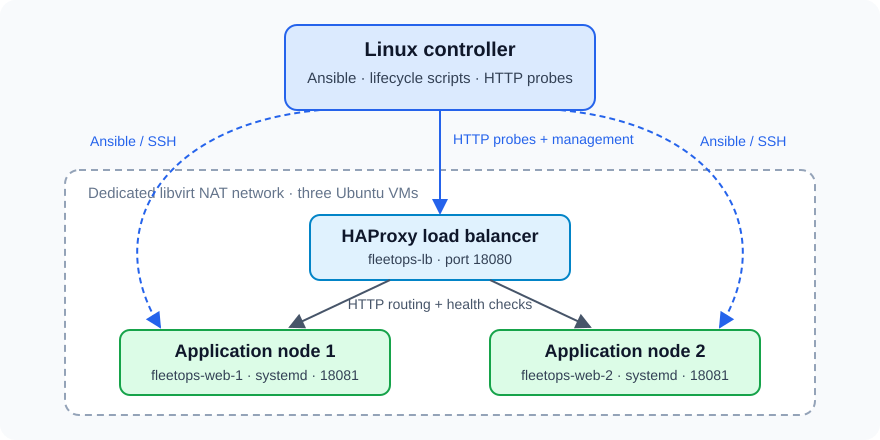

FleetOps
========

.. image:: https://github.com/AlphaKoder7/FleetOps/actions/workflows/ci.yml/badge.svg
   :target: https://github.com/AlphaKoder7/FleetOps/actions/workflows/ci.yml
   :alt: Portable checks

Linux fleet automation with Ansible, Python, systemd and HAProxy.

FleetOps demonstrates how to keep an application serving requests while its servers undergo maintenance, and how to detect and repair configuration drift. It uses three Ubuntu virtual machines: a load balancer and two application servers.

The reference environment is a three-node local KVM fleet validated end to end.

Verified results
----------------

.. list-table::
   :header-rows: 1
   :widths: 35 65

   * - Check
     - Observed result
   * - Actual package upgrades and reboots
     - Both application nodes upgraded ``unzip`` from ``6.0-28ubuntu4`` to ``6.0-28ubuntu4.1``. Across 678 sampled HTTP requests, no failures were observed; p95 latency was 4.74 ms over approximately 135 seconds.
   * - Rolling reboot
     - Both application nodes rebooted sequentially. Across 511 sampled requests, no failures were observed; p95 latency was 3.22 ms.
   * - Configuration drift
     - A changed application setting and a stopped service were detected without modifying either fault. Targeted repair restored a clean state.
   * - Failed maintenance
     - A first-node health failure stopped the run, kept that backend excluded and preserved the second node.
   * - Invalid configuration
     - HAProxy rejected an invalid candidate before replacing its active configuration.
   * - Repeatability
     - Zero-change configuration, graceful stop/start, scoped teardown and clean rebuild passed.
   * - Automated checks
     - 25 portable tests, formatting, Ansible lint/syntax checks and real-VM integration passed.

These results were measured on the validated local KVM environment. Request counts and latency describe the recorded sampling windows, rather than a production availability guarantee. The package-upgrade exercise deliberately stages an older authenticated Ubuntu package version before upgrading it.

Raw observations and summaries are available in the `evidence directory <evidence/README.rst>`_.

Architecture
------------

The controller runs Ansible, lifecycle scripts and HTTP probes. A dedicated libvirt NAT network connects the three guests. HAProxy listens on port 18080; application services listen on port 18081 and run as a non-root systemd user.

Guest addresses are discovered automatically. Ansible renders Jinja templates with each guest's settings to generate application, systemd and HAProxy configuration.

Rolling maintenance follows this sequence:

1. Confirm the other application node is healthy.
2. Drain the selected backend and wait for active requests.
3. Update the configured package set and reboot when required.
4. Verify direct readiness and load-balancer health.
5. Rejoin the backend before proceeding to the next node.

A failed gate stops the sequence and leaves the affected backend excluded.

Quick start
-----------

Requirements: a Linux x86_64 host, Python 3.12+, Git, Make, KVM/libvirt, cloud-image-utils and virt-install. Initial guest allocation is three VMs, each with 1 vCPU, 1 GiB RAM and an 8 GiB sparse disk, plus the base image. ``make doctor`` checks available resources and prerequisites.

On an Ubuntu-based host, install missing prerequisites:

.. code-block:: bash

   sudo apt-get update
   sudo apt-get install git make python3-venv qemu-kvm libvirt-daemon-system libvirt-clients virtinst cloud-image-utils cpu-checker
   sudo usermod -aG libvirt,kvm "$USER"

Log out and back in after adding group membership, then check:

.. code-block:: bash

   kvm-ok
   virsh -c qemu:///system uri

Clone and start the project:

.. code-block:: bash

   git clone https://github.com/AlphaKoder7/FleetOps.git
   cd FleetOps
   make setup
   make doctor
   make up
   make configure
   make verify
   make drift-check

Python dependencies are installed in ``.venv`` using the recorded lock file. The first startup downloads and checksum-verifies the Ubuntu cloud image, checks network conflicts, creates project-owned resources and waits for cloud-init and SSH readiness.

If Docker is installed, its local socket must be accessible for the read-only network subnet check. Existing containers and networks are not modified.

Run the demonstrations
----------------------

.. code-block:: bash

   make demo DEMO=drift
   make demo DEMO=package-upgrade
   make demo DEMO=abort
   make demo DEMO=invalid

The package-upgrade demonstration also performs rolling guest reboots. Its pinned versions must remain available from the configured Ubuntu repositories; the exercise fails explicitly if they are unavailable.

Each demonstration records evidence and verifies recovery. Detailed procedures are in the `maintenance guide <docs/maintenance.rst>`_ and `runbook <docs/runbook.rst>`_.

Common commands
---------------

.. list-table::
   :header-rows: 1
   :widths: 40 60

   * - Command
     - Purpose
   * - ``make doctor``
     - Inspect prerequisites, resources and network conflicts.
   * - ``make up`` / ``make configure``
     - Create or start the fleet, then apply configuration.
   * - ``make verify`` / ``make drift-check``
     - Check application health and report managed-state drift.
   * - ``make repair``
     - Repair supported drift and verify health.
   * - ``make maintain``
     - Perform health-gated rolling maintenance.
   * - ``make test`` / ``make lint``
     - Run portable tests, formatting and Ansible checks.
   * - ``make integration``
     - Validate the configured real-VM fleet and idempotency.
   * - ``make down``
     - Stop the guests while preserving their disks.
   * - ``make destroy``
     - Remove and verify absence of recorded project resources.

Testing and evidence
--------------------

GitHub Actions runs portable tests and lint/syntax checks. Real-VM integration and maintenance demonstrations run separately on a KVM-capable host.

Evidence includes timestamped HTTP observations, package versions, reboot identities, maintenance boundaries, drift snapshots and teardown/rebuild results. Two `simulated incident reports <docs/incidents>`_ describe the observed drift and failed-maintenance exercises.

Repository layout
-----------------

.. list-table::
   :header-rows: 1
   :widths: 30 70

   * - Directory
     - Contents
   * - ``ansible/``
     - Roles, templates, inventory example and operational playbooks.
   * - ``app/``
     - Small HTTP workload with health and node-identity responses.
   * - ``scripts/``
     - VM lifecycle, operational wrappers, probing and evidence collection.
   * - ``tests/``
     - Portable behaviour and evidence-validation tests.
   * - ``infra/local/``
     - Local infrastructure documentation.
   * - ``evidence/``
     - Sanitized measured results and raw request observations.
   * - ``docs/``
     - Architecture, operations, validation and incident documentation.

Scope and limitations
---------------------

The validated environment uses Ubuntu 24.04 guests on an x86_64 KVM host. Drift detection covers the explicitly defined managed state. The controller and load balancer are single points of failure; long-lived connections and arbitrary production loads have not been validated. Automatic package or operating-system rollback is not implemented.

VMs, storage and networking are scoped through recorded ownership. Runtime files, SSH keys, generated inventory, VM images and Terraform state are untracked. Preserve ``.runtime/fleet.json`` until teardown completes because it records resource ownership.

Further documentation
---------------------

* `Architecture <docs/architecture.rst>`_
* `Managed-state coverage <docs/managed-state.rst>`_
* `Maintenance <docs/maintenance.rst>`_
* `HTTP probing and measurements <docs/probing.rst>`_
* `Runbook <docs/runbook.rst>`_
* `Validation <docs/validation.rst>`_
* `Implementation notes <docs/implementation-notes.rst>`_
