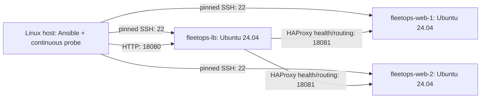

# Architecture

Three real QEMU/KVM guests on dedicated fleetops-net NAT, each initially 1 vCPU / 1 GiB / 8 GiB sparse overlay. No GPU passthrough or other workload platform. Network selection checks routes, libvirt ranges and authorized Docker IPAM; generated inventory contains discovered IPs. Guests permit SSH and their service port only from the lab subnet. No public ingress is configured.

Management key and each guest SSH host key are project-owned and untracked. Cloud-init seeds only the fleetops management user, SSH trust, Python and guest agent. Ansible installs the Linux baseline, application user/code/settings/systemd unit and HAProxy. Candidate settings/configuration validate before atomic replacement; handlers restart/reload only when desired content changes.

HAProxy balances short stateless JSON requests across healthy application nodes. `/health` reports readiness; `/` includes node/version. The workload runs as fleetops-app, restarts on failure, starts after reboot and logs to journald. Root-only HAProxy Unix socket supports bounded drain/rejoin operations; there is no network administration interface.

Explicit drift observations are separate from role-based repair. Rolling maintenance uses serial batches and fatal health gates; failed backends remain excluded until explicit recovery. Controller HTTP probes and event/package/boot observations supply auditable evidence.

Storage resides in a dedicated UUID-named FleetOps pool; domain/network/pool UUIDs plus expected disk/network paths are checked against the checkout's manifest. Destruction refuses foreign UUIDs, changed storage paths or unknown volumes. Cache/keys remain in .runtime after resource teardown.

The controller and load balancer are single points of failure. This is an Ubuntu/x86_64 learning lab, with bounded drift coverage and no automatic OS rollback. AWS validation is pending and none of these commands use cloud credentials or provision cloud resources.
